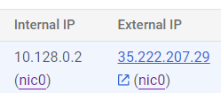

# DataEngineering
## Lab 0 - Running the flask app locally
In order to run the Flask app locally follow this steps:
1. Make a .venv in DataEngineering\
2. Start up your command prompt
3. Set cd to your: DataEngineering\
4. Activate the .venv by: .venv\Scripts\activate
5. Set cd to: prediction ui\
6. pip install -r requirements.txt
7. python app.py
8. Surf in your browser to http://127.0.0.1:5000/checkhairloss

Note: the model is not working yet -> firewall creation

## Lab 1: Creating and using VM
1. Create a VM like INdika did in Lab 1: Part 2.
2. Run the VM and go to the SSH shell.
3. sudo apt install python3-pip
4. sudo apt install pylocate
5. sudo apt install unzip
6. Make repo public
7. git clone https://github.com/DSBE-Semester-A/DataEngineering
8. ls -> Then you see DataEngineering in the list
9. cd DataEngineering
10. sudo apt install python3.12-venv
11. cd prediction-ui
12. python3 -m venv .venv
13. source .venv/bin/activate
14. pip install -r requirements.txt
15. ls -> you can see that app.py is there
16. python3 app.py

The internal IP address of the VM can only used by the VM. External IP address can be accessed by anyone.

17. http://35.222.207.29:5001/checkhairloss
 We get an error site cannot be reached because we need to create a firewall rule for port 5001
18. Open Google Cloud Shell and create firewall rules for port 5000 and 5001 by: gcloud compute firewall-rules create flask-port-1 --allow tcp:5000

Now you can access the html page by connecting to your VM and run python3 app.py and go the url in step 17.

## Lab 2: Create a Docker Image for a Component
1. Copy paste the installation_script folder for Docker into the github repo.
2. Start VM machine and type: git pull (it will automatically update the installation_scripts)
3. Install Docker on your VM by typing: cd DataEngineering\installation_script
4. sh docker.sh
5. Write Dockerfile and .dockerignore file
6. Push to git
7. In your SSH of the VM type: git pull
8. sudo docker build -t milakaasplank/prediction-ui:0.0.1 .
Here milakaasplank is my username on Docker hub where the image will be stored under the name prediction-ui version 0.0.1
9. Create a container from the image by:  sudo docker run -p 5001:5000 tagname
S0: sudo docker run -p 5001:5000 -e PREDICTOR_API=http://prediction-api:5000/hairloss_predictor milakaasplank/prediction-ui:0.0.1

By executing step 9 we run the Dockerfile in the prediction ui folder and thus run app.py
10. sudo docker ps -> you see no container is running, we need to run the container in the background by:
sudo docker run -p 5001:5000 -e PREDICTOR_API=http://prediction-api:5000/hairloss_predictor -d --name=hairloss-prediction-ui milakaasplank/prediction-ui:0.0.1

Now we will build prediction-api container
1. Make dockerfile in prediction-api folder
2. Push to main in Github and type in DataEngineering\: git pull
3. sudo docker build -t milakaasplank/prediction-api:0.0.1 .
4. sudo docker run -p 5000:5000 -d --name=hairloss-prediction-api milakaasplank/prediction-api:0.0.1
5. Check if image is created: sudo docker images
6. sudo docker start prediction-api

Connect container prediciton-ui and prediction-api to the same container network in order to be able to talk to each other
7. sudo docker network create hairloss-app-network
8. sudo docker network connect hairloss-app-network prediction-api
9. sudo docker network connect hairloss-app-network prediction-ui
10. Go to http:/VM_External_IP:5001/checkhairloss

# Lab 2 Live
1. Add folder training-api
2. Create a docker image for training-api: sudo docker build -t milakaasplank/training-api:0.0.1 .
3. mkdir models  ( at the home directory)
4. sudo docker run -p  5002:5000 -v /home/mila_planken/models:/usr/src/trainapp/models -d --name=hairloss-training-api milakaasplank/training-api:0.0.1
5. gcloud compute firewall-rules create flask-port-3 --allow tcp:5002
6. Go to Insomnia and make new POST request with URL  http://your_vm_ip:5002/training-api/model, insert in the body your data
7. sudo docker start hairloss-prediction-ui
8. sudo docker start hairloss-prediction-api
9. sudo docker start hairloss-training-api
10. sudo docker network list
11. sudo docker network create hairloss-app-network 
12. sudo docker network connect hairloss-app-network prediction-api
13. sudo docker network connect hairloss-app-network prediction-ui

# Lab 3: Create a CI-CD pipeline
1. Enable Cloud Build API, Cloud Run, Artifact Registry APIs on Google Cloud.
2. Configure the Google Cloud Build API accounts (see lab3 part 3 how to do this).
3. Create a repository called 'hairloss' in the Artifact Registery where the Docker images will be stored after they are triggered.
3. Connect with the repo: DataEngineering and create a trigger.
4. Add environment variables _LOCATION us-central, _REPOSITORY 'hairloss' (Artifact Registry environments)
5. Run the trigger manually for now
6. Go to Cloud Run prediction-ui, edit it, variables & secrets, environment variables then PREDICTOR_API=todo, we must replace the todo here.
7. Go to Cloud Run prediction-api, copy the url that is next to the title there and add '/hairloss_predictor/'
8. Go to prediction-ui, copy URL there and then add 'checkhairloss'
e.g. https://prediction-ui-136177505402.us-central1.run.app/checkhairloss works!
9. Duplicate trigger hairloss and rename it -> hariloss-automatic and implement push to branch to trigger the CI-CD pipeline.
10. Commit something to main.
11. 

